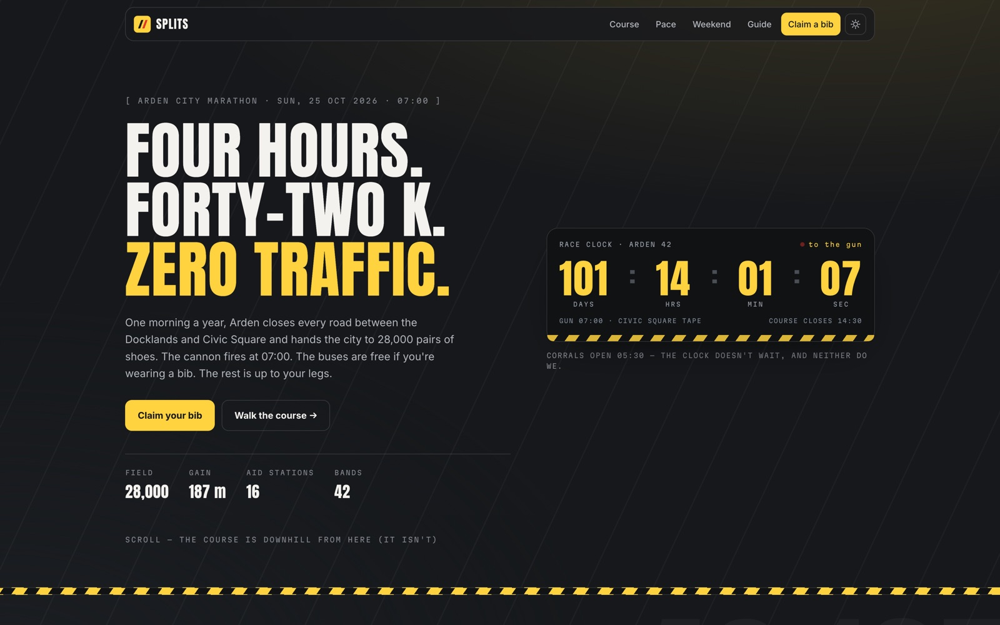

<!-- parable:beautified -->
<div align="center">

<h1>Splits</h1>

<p><strong>City marathon — a course elevation profile that draws itself, plus a pace calculator that splits your goal time.</strong></p>

<p>
  <a href="https://bswxyz.github.io/splits/"></a>
  
  
  <a href="LICENSE"></a>
</p>

<p>
  <a href="https://bswxyz.github.io/splits/"><b>Live demo</b></a>
  &nbsp;·&nbsp;
  <a href="https://bswxyz.github.io/splits/guide/">Build notes</a>
  &nbsp;·&nbsp;
  <a href="https://parable-three.vercel.app/templates">More templates</a>
</p>

<a href="https://bswxyz.github.io/splits/">
  
</a>

</div>

**Use this template** — copy the source into a new project:

```bash
npx degit bswxyz/splits my-app
```


A design-showcase website template for a big-city marathon: countdown to the cannon, an
interactive course profile, a working pace calculator, the race-weekend schedule, and a
demo registration flow. Part of the **Parable** template collection.

> Arden is a fictional city. The hills, sadly, behave like real ones.

## Concept

One morning a year, the city closes every road and hands itself to 28,000 runners. The
site is built around that energy: a race clock counting to the fourth Sunday of October,
an elevation profile that **draws itself as you scroll** (runner dot riding the line, km
markers popping in as it passes), and a pace calculator that projects your splits — then
tells you, on the course chart itself, what time you'll crest Reservoir Hill.

## Design system

- **Palette** — race-white `#f4f2ee` / asphalt `#16181b`, flipped across light and dark
  themes; split-yellow `#ffd23f` accent; finish-red `#e0342b` (deepened on light surfaces
  for contrast). Tokens live at the top of `styles.css` on `:root[data-theme]`.
- **Type** — [Anton](https://fonts.google.com/specimen/Anton) for display (bib-number
  energy), Inter for body, Martian Mono for anything a race official would print.
- **Signature ease** — the "tape-break": `cubic-bezier(.18, .89, .3, 1.04)` — surge,
  snap, a hair of overshoot, settle.
- **Zero image files** — all art is inline SVG and CSS (the start-line tape is a
  `repeating-linear-gradient`).

## Stack

- [Vite](https://vitejs.dev) + vanilla **TypeScript** (strict). No framework, no chart
  library, no runtime dependencies.
- The elevation SVG ships fully drawn in the HTML; `src/course.ts` only adds the
  scroll-linked dash draw, the runner dot (`getPointAtLength`), and the marker readout.
- `src/pace.ts` — two-half split model; broadcasts `splits:plan` so the course readout
  can quote your projected arrival at any marker.
- Full `prefers-reduced-motion` support: the chart renders complete, the countdown
  renders once, nothing loops.

## Run locally

```sh
npm install
npm run dev        # dev server
npm run build      # type-check + build → docs/
npm run preview    # serve the production build
```

## Structure

```
index.html            entry — semantic sections, inline SVG course profile
styles.css            design tokens (light + dark) + all styling
src/main.ts           theme toggle, reveals, form, bootstrapping
src/course.ts         signature 1 — self-drawing elevation profile
src/pace.ts           signature 2 — pace calculator + splits table
src/countdown.ts      race clock (rolls to next year's race automatically)
src/reveal.ts         IntersectionObserver reveals + counters
src/data.ts           course markers: km, elevation, grade, local names
public/guide/         "How Splits was built" — static build guide
public/.nojekyll      keeps GitHub Pages from running Jekyll
vite.config.ts        base '/splits/', outDir 'docs'
```

## Demo vs. real

- The **registration form** validates and confirms in place with a fictional bib number.
  It sends nothing, stores nothing, and charges nobody. Wire it to a real entry platform
  before using it for an actual race.
- The **countdown** targets the fourth Sunday of October and re-aims at next year once
  race day passes — change `fourthSundayOfOctober()` in `src/countdown.ts` for your date.
- Course data in `src/data.ts` is invented but dimensionally honest (42.195 km, 187 m
  gain, 2× vertical exaggeration on the chart). Swap in your own survey points.

## License

[MIT](./LICENSE) © 2026 Parable
